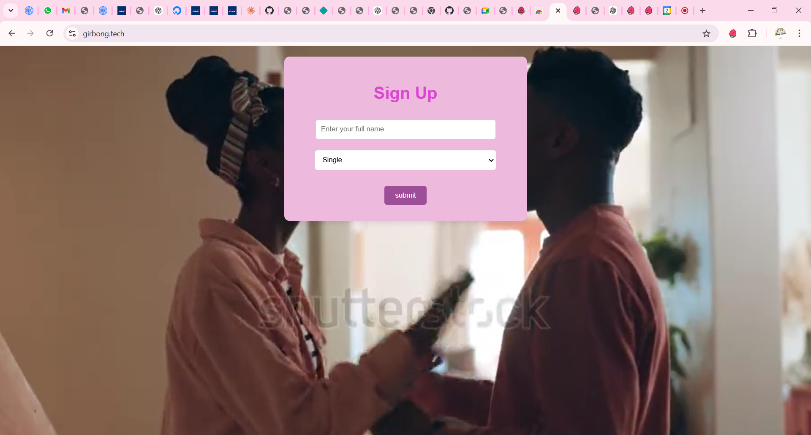

# MyRelationship app

 MyRelationship is a sleek and user-friendly platform that allows users to explore and connect their current emotion to an activity. Powered by html,css  and javascript.

## Screenshots 📸

### Home Page



### Page dashboard


---

## Live Website 🌐

Check out the live version of the app here: [MyRelationship](https://girbong.tech/)

---

## DemoVideo 🎥

Check out the demo video of the app here: [myrelationship demo)](https://jam.dev/c/dd722514-a0fd-48a9-88a3-d05e15426f30)

## Features ✨

- **sign up** your name and status.
- **View dashboard** including the activity user may want to engage in.
- **click an activity** gets a precised item.
- Responsive design for seamless experience across devices.

---

## Technologies Used 🛠️

- **Frontend**: HTML,CSS and Javascript
- **API**: Created an express API, and hosted it on render.com
- **Deployment**: Netlify and automated deploys on push

---


## Installation 🏗️

To run the app locally, follow these steps:

Clone the repository:

```bash
Copy code
git clone https://github.com/NFORMII/my-application
cd my-application


bash
Copy code
start live server on vs-code
Open http://localhost:5000 in your browser to explore the app.
```

---

## Acknoledgements 🙌
- [Render](https://www.render.com/) for efficient deployment.